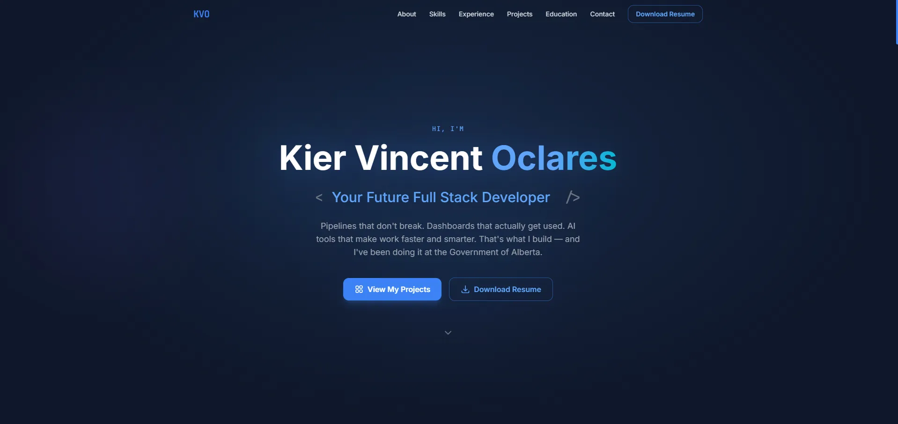

<div align="center">

# Kier Vincent Oclares — Developer Portfolio

**Future Full Stack Developer · Data Engineer · AI Integration Specialist**

[](https://react.dev/)
[](https://www.typescriptlang.org/)
[](https://vitejs.dev/)
[](https://tailwindcss.com/)

</div>

A modern, fully responsive personal portfolio SPA showcasing my background in full-stack development, data engineering, and AI-assisted development. Built with a deep navy + electric blue design system, smooth scroll animations, and all content cleanly separated into typed TypeScript constants — no backend required.



---

## 🚀 Tech Stack

| Layer | Technology |
|-------|------------|
| Framework | React 18 (strict mode) |
| Language | TypeScript 5 (strict mode) |
| Bundler | Vite 5 |
| Styling | Tailwind CSS 3 |
| Fonts | Inter + JetBrains Mono (Google Fonts) |
| Icons | Lucide React + React Simple Icons |
| Analytics| Vercel Analytics |
| Deployment | Vercel (automatic deploys from `main`) |

---

## 📁 Project Structure

```
├── public/                  # Favicon and other public assets
├── resume/                  # Resume markdown source and PDF generator scripts
├── src/
│   ├── assets/
│   │   ├── images/              # Static images
│   │   └── resume/              # Generated Resume PDF
│   ├── components/
│   │   ├── layout/
│   │   │   ├── Navbar.tsx        # Sticky nav bar with mobile hamburger menu
│   │   │   └── Footer.tsx        # Site-wide footer
│   │   ├── sections/
│   │   │   ├── Hero.tsx          # Full-viewport hero with typewriter animation
│   │   │   ├── About.tsx         # Professional summary + stat cards
│   │   │   ├── Skills.tsx        # Categorized skill grid with SVG icons
│   │   │   ├── Experience.tsx    # Vertical timeline of work history
│   │   │   ├── Projects.tsx      # Project card grid
│   │   │   ├── Education.tsx     # NAIT diploma entries with honors badges
│   │   │   └── Contact.tsx       # Contact cards + copy-to-clipboard email
│   │   └── ui/
│   │       ├── Badge.tsx          # Styled pill/tag (skill, status, stack)
│   │       ├── Card.tsx           # Reusable glass card wrapper
│   │       ├── Button.tsx         # Primary and outline button variants
│   │       ├── SectionHeader.tsx  # Consistent section heading
│   │       └── Timeline.tsx       # Vertical timeline (Experience/Education)
│   ├── data/
│   │   ├── profile.ts            # Name, titles, about text, social links
│   │   ├── skills.ts             # Categorized skills with SVG icon paths
│   │   ├── experience.ts         # Work experience entries
│   │   ├── projects.ts           # Portfolio project definitions
│   │   ├── education.ts          # Degrees, certifications
│   │   └── nav.ts                # Navigation links configuration
│   ├── hooks/
│   │   ├── useScrollAnimation.ts # Intersection Observer scroll animation
│   │   ├── useTypingCycle.ts     # Typewriter cycling animation
│   │   └── useActiveSection.ts   # Observer for active nav section state
│   ├── types/
│   │   └── index.ts              # All TypeScript interfaces and types
│   ├── utils/
│   │   └── index.ts              # Shared utility functions
│   ├── App.tsx                    # Root component — composes all sections
│   ├── main.tsx                   # Entry point (React StrictMode)
│   └── index.css                  # Tailwind directives + global styles
```

---

## ⚙️ Development Workflow

Here is a quick overview of how I run this project locally for development:

```bash
# Install dependencies
npm install

# Start development server
npm run dev
```

The application runs locally on [http://localhost:5173](http://localhost:5173).

### Building & Verification

```bash
# Type-check and build production bundle
npm run build

# Verify code quality
npm run lint
npm run format
```

---

## 🗂️ Available Scripts

| Script | Description |
|--------|-------------|
| `npm run dev` | Start Vite development server at `localhost:5173` |
| `npm run build` | Type-check and bundle for production (output: `dist/`) |
| `npm run preview` | Locally preview the production build |
| `npm run lint` | Run ESLint across all TypeScript/TSX files |
| `npm run lint:fix` | Run ESLint and automatically fix found issues |
| `npm run format` | Run Prettier to format source code |
| `npm run generate:resume` | Generate PDF resume from the markdown source |

---

## 🚀 Infrastructure & Deployment

The portfolio is continuously deployed to Vercel. Any `git push` to the `main` branch triggers an automatic production build.

### Content Management

Site content is fully decoupled from the UI components. All text, assets, and metadata live in typed TypeScript constants under `src/data/`:

| File | Domain |
|------|--------|
| `src/data/profile.ts` | Core identity, bio, and contact info |
| `src/data/experience.ts` | Professional timeline and roles |
| `src/data/projects.ts` | Portfolio showcases and case studies |
| `src/data/skills.ts` | Technical skills definitions |
| `src/data/education.ts` | Academic history and degrees |

---

## 📄 Resume Updates

To update the resume:
1. Edit resume/KierVincentOclares_Resume.md
2. Run: npm run generate:resume
3. Commit both the MD and PDF files
4. git push — Vercel serves the updated PDF

---

## 📬 Contact

- **Email:** [KierVOclares@gmail.com](mailto:KierVOclares@gmail.com)
- **LinkedIn:** [kier-vincent-o-2150051a0](https://www.linkedin.com/in/kier-vincent-o-2150051a0/)
- **GitHub:** [KVOclares](https://github.com/KVOclares)
- **Portfolio:** [kiervoclares.works](https://kiervoclares.works/)

---

## 📄 License

This repository is primarily for my personal portfolio. You are more than welcome to explore the source code for reference, learning, or inspiration! I just politely ask that you do not reuse my personal branding, content, or resume data if you adapt any part of the code for your own projects.
